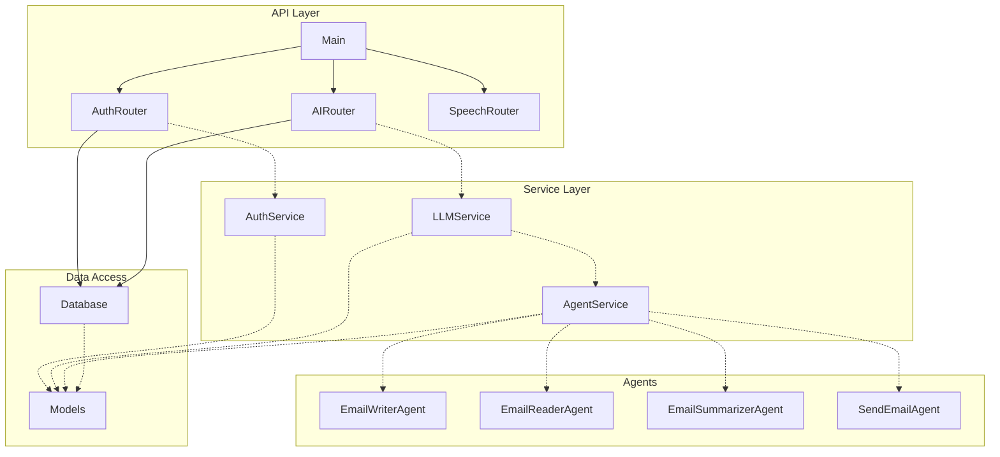
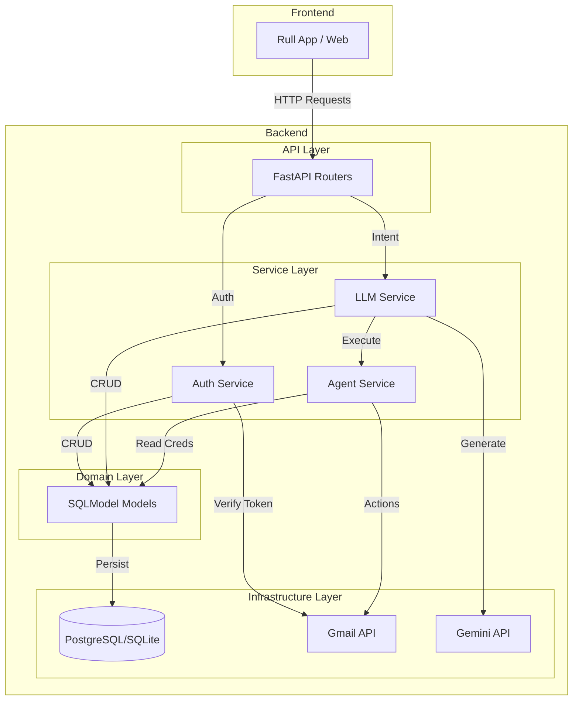
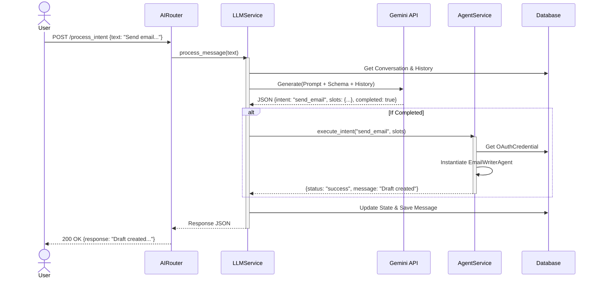

# DriveMail Backend Architecture

## 1. Component Diagram
This diagram visualizes the code structure and dependencies between modules.

## 2. Architecture Layers
This diagram shows the logical layering of the system.

## 3. Sequence Diagram (Intent Processing)
This diagram illustrates the flow of a user request to process an intent (e.g., "Send an email").

